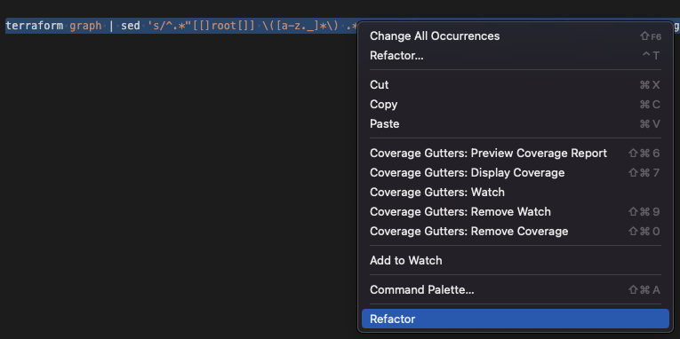
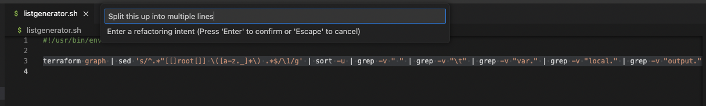
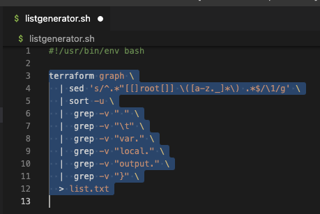

# codex-review

This is a simple VSCode extension to use the OpenAI Codex API for refactoring based on Natural Language Inputs

## Features

Highlight text, right click to refactor, enter a desired intent, and have OpenAI do the heavy lifting.

Example:

### Select Text to Refactor

### Enter your intent

### Results

